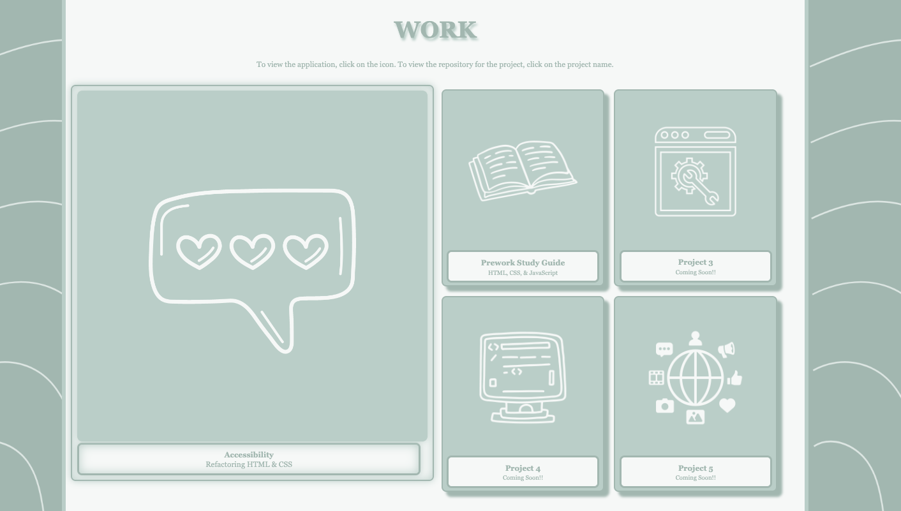
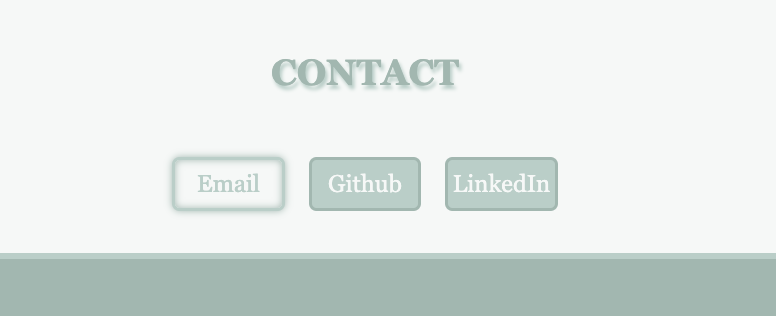
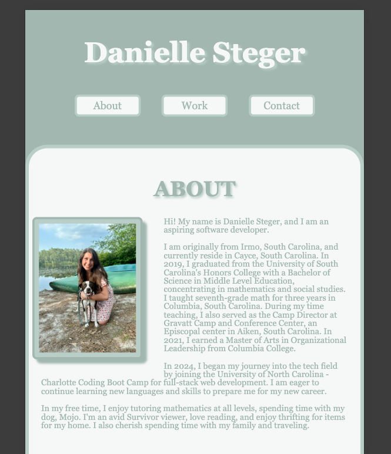
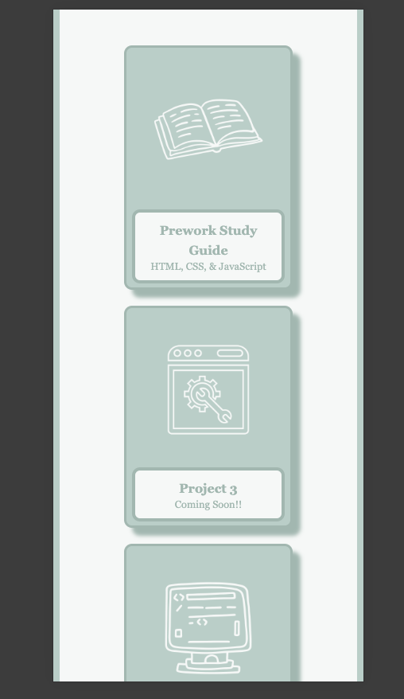

# danielle-steger-portfolio

## Description

This project involved creating a personal portfolio webpage from scratch using HTML and CSS. This practical project not only helped me to practice using HTML, CSS, and debugging code, it also provides a practical page to use in the future when job searching. You can view this webpage by clicking [here](https://danimsteger.github.io/danielle-steger-portfolio/).

## Installation

To access the live project, you can visit this [link](https://danimsteger.github.io/danielle-steger-portfolio/)

To view the code of this project, you can clone this repository using the following commands in your command line:

### Clone this repository
~~~
git clone git@github.com:danimsteger/danielle-steger-portfolio.git
~~~
### Go into this repository
~~~
cd danielle-steger-portfolio
~~~
### Access code of the repository
~~~
code .
~~~

## Usage

The navigation links at the top of the page will take you to their corresponding sections when you click on them.

The "Work" section displays several icons for different projects.  When you click on the icon, it will direct you to the live application.  When you click on the project name, it will direct you to the repository for the correspoinding project.

The "Contact" bar at the bottom of the page has links that will direct you to compose an email to me, or access my Github and LinkedIn in a new tab.

To view the responsiveness of the webpage, you can right click the page and click 'Inspect' then click the Toggle Device Toolbar or by pressing Cmd+Shift+M on macOS or Ctrl+Shift+M on Windows. From there, you can select different devices or choose 'Responsive' to change the size of your window yourself. 

Below is the view of the page on an iPad Mini. At this size, the side images have been removed.

Below is the view of the page on an iPhone SE.  At this size, the smaller project cards have moved from the right side to a singular column below the larger project card.

## Credits

This project was entirely created by Danielle Steger.  To complete this project, I referenced several articles on "MDN Web Docs" and "W3Schools." Additionally, I referenced materials provided by edX Boot Camps LLC.

## License

Distributed under the MIT License.  See [LICENSE](LICENSE).
